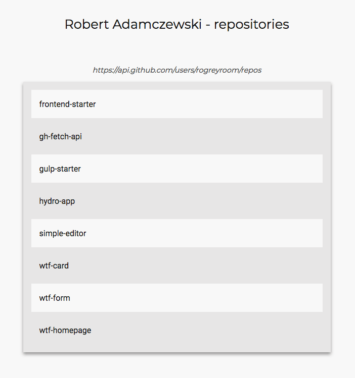

# gh-fetch-api

Testing github api with fetch api.

## Website 🚀

[go to the website](https://rogreyroom.github.io/gh-fetch-api/)



## Build with

- [gulp-starter](https://github.com/rogreyroom/gulp-starter)


## Deploy

To deploy public folder to **gh-pages** brunch

```git
> git checkout gh-pages
> git rm -f -r --ignore-unmatch ./**
> git checkout [master/feature-branch] -- 'public/**'
> git mv -f public/** ./
> git commit . -m "build: website deploy `date +\"%Y-%m-%d\"`"
```

## Version

v.1.0.0

## Author

Robert Adamczewski

## License

This project is licensed under MIT License - see the [LICENSE.md](./LICENSE.md) file for details.
